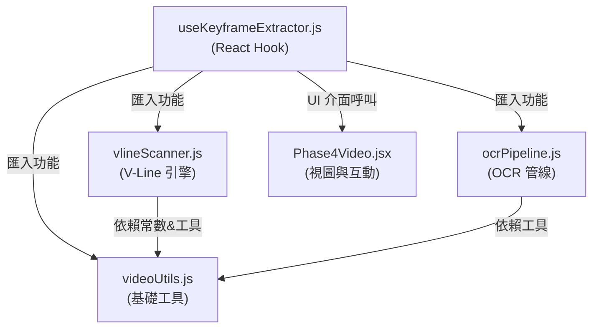
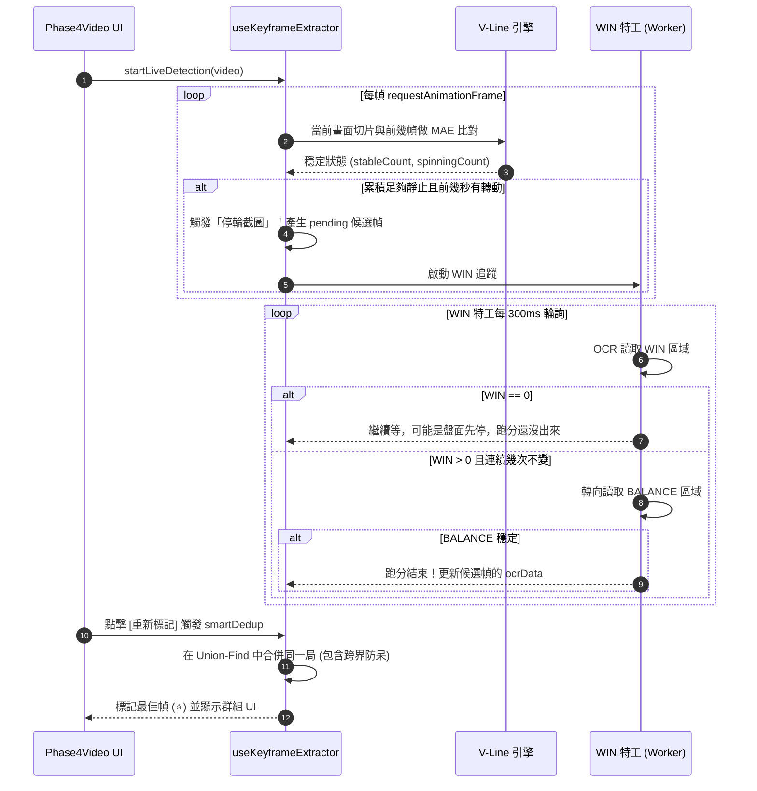

# 老虎機線獎辨識工具架構 (Architecture)

本文件紀錄老虎機線獎辨識工具的核心架構與資料流向。主要針對影片辨識核心 (`src/engine/` 與 `src/hooks/useKeyframeExtractor.js`) 進行說明。

## 模組依賴關係

針對原本巨型的 1450 行大混雜，我們進行了模組化拆分。目前的依賴架構如下：

### 1. `videoUtils.js` (基礎影像工具)
- **定位**：無狀態、無外部依賴的純函數庫。
- **職責**：
  - `extractROIGray`: 將影片的感興趣區域 (ROI) 擷取並轉換成低解析度 (128x128) 灰階陣列。
  - `computeMAE`: 計算兩張灰階影像的平均絕對誤差 (Mean Absolute Error)，這是判斷動態/靜止的核心指標。
  - `getCachedCanvas`: 提供離屏 (Offscreen) Canvas 快取，避免記憶體洩漏。

### 2. `vlineScanner.js` (V-Line 切片引擎)
- **定位**：負責解析老虎機的「軸 (Reels)」運動狀態。
- **職責**：
  - `extractSliceGrays`: 將盤面依照欄數 (預設 5 軸) 進行垂直切割。
  - `analyzeSlicePattern`: 判斷目前是「全軸停輪」、「部分旋轉中」，還是「動畫閃爍狀態」。這是避免把獲獎動畫誤認為重新旋轉的核心。

### 3. `ocrPipeline.js` (OCR 辨識管線)
- **定位**：將影像交付給 PaddleOCR 進行文字讀取。
- **職責**：
  - 封裝 WebAssembly Worker，並加上**全域排隊鎖 (Global Queue)**，確保在高頻度的即時辨識 (如 WIN 特工追蹤跑分時) 不會造成記憶體崩潰。
  - `cropAndOCR`: 封裝了裁切、放大兩倍、建立黑底 Padding，以提升 DBNet 文字框檢測的成功率，並過濾掉雜訊只保留數字。

### 4. `useKeyframeExtractor.js` (狀態控制器 / Hook 本體)
- **定位**：串接所有模組並結合 React 狀態流的核心大腦。
- **職責**：
  - 以 `requestAnimationFrame` 進行影片即時抽幀 (Live Detection)。
  - **WIN 追蹤特工**：一旦辨識到停輪，發動非同步輪詢機制，追蹤「跑分區(WIN)」的跳動，直到確定數字不再變化，且總分(BAL)也穩定後，才最終確定候選幀的數值。
  - **自適應分組 (Smart Dedup)**：運用 Union-Find 演算法將屬於「同一局」的零散畫面分組在一起。

---

## 核心資料流與狀態機

以下為一局遊戲的生命週期與資料流動：

## 重要演算法備註

1. **時間單向性 (areSameSpin)**: 分組條件不只看「押注(BET)相同」，還必須遵守**時間先後**與**狀態單向演進**。例如：WIN > 0 的畫面絕對不能合併在時間比它更晚的 WIN = 0 畫面上，防範跨局「死局」被錯誤連坐。
2. **多幀抗壓比對**: 在 V-Line 引擎中，我們將當前畫面同時和 `N-1` 以及 `N-2` 的歷史幀比對。這是為了抵抗影片解碼時常發生的「卡頓複製幀」(例如瀏覽器給了兩張一模一樣的卡頓畫面，若只和前一張比，MAE = 0 會被誤判為完全靜止)。
